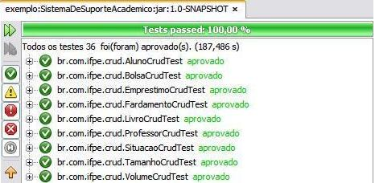
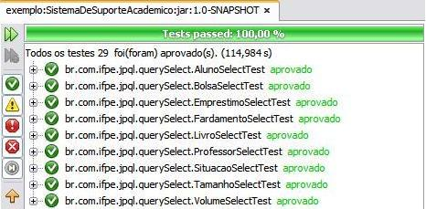
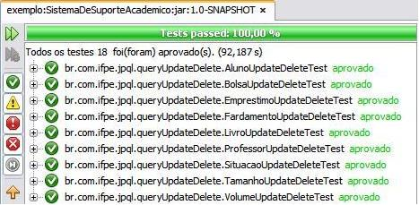
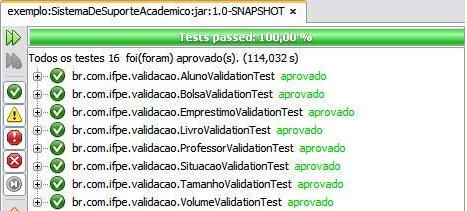

# Sistema de Suporte Acadêmico - Update

Alterações da 2ª entrega do projeto SSA conforme solicitado pelo profº [Marcos André](https://github.com/marcosifpe) para pontuação extra na disciplina de Desenvolvimento de Software Corporativo (DesCorp).

## Projeto principal

As quatro entregas que compõem o projeto principal podem ser vistas [aqui](https://github.com/Gwolner/entregas-descorp-sae). Cada entrega serviu para formação da nota durante as unidades avaliativas da disciplina.

## Diferenças entre projetos

Entre as principais inclusões e alterações destacam-se:

* Criação de classes de consulta (SELECT) JPQL para cada entidade: Antes só havia uma única classe com vários tipos de consultas (MIN, MAX, BETWEEN, IN, COUNT, LIKE, ORDER BY e outras);

* Criação de classes de atualização e exclusão (UPDATE e DELETE) JPQL para cada entidade: Antes só havia uma única classe com um UPDATE e um DELETE;

* Adição de NamedQuery nas entidades: Havia apenas CreateQuery realizando a maioria dos SELECTs do primeiro item;

* Adição de dois JOINs, um AVG e um SUM: Itens solicitados durante a refatoração do projeto.

## Testes unitários

Os testes construidos com uso do JUnit tiveram resultados positivos.

* Testes de CRUD

* Testes de JPQL- SELECT

* Testes de JPQL- UPDATE e DELETE

* Testes de Validation

